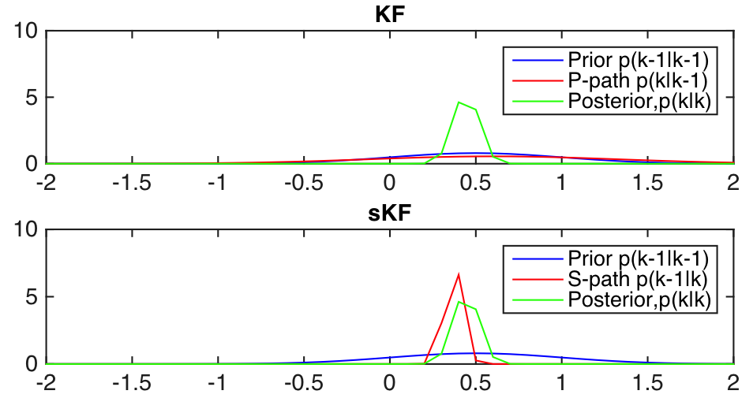

# DASoftware
============

This is a Matlab library of data assimilation methods developed to solve large-scale state-parameter estimation problems. Data assimilation approach has been widely used in geophysics, hydrology and numerical weather forecast to improve the forecast from a numerical model based on data sets collected in real time. Conventional approach like Kalman filter is computatioanlly prohibitive for large problems. The DASoftware library takes advantage of advances in computatioanl science and consists of new data assimilation approach that is scalable for large-scale problems. The functions and examples are produced based on collabrated work on data assimialtion documented in the papers listed in the Reference section.

**This is an ongoing project. The library is incomplete.**

## Highlight
- Data assimilation tools for Large-scale real-time estimation problems


- Computationally efficient methods with linear complexity(O(m)) that runs fast even on laptops


- Hands-on examples to learn Kalman filters without the knowledge of the technical details  


## Summary of Example
| Example  | Dimension | Linearity | Specific |
| -------: |:---------:|:----------|:--------:|
| Saetrom  | 1D        | Linear    | F(x,t)   |
| Target tracking  | 1D        | Nonlinear    | F(x),H(x)   |
| Frio     | 2D        | Linear    | F = I, fixed H   |


## Summary of methods

Here we show a diagram of the methods provided in the library.


|  Method  |  Assumptions                 |  Jacobian matrix|  Covariance matrix |   
| -------: |:----------------------------:|:------------------------: |:--------------|   
|  HiKF    | fast data acquisition/fixed H| no forward run| O(m) operations |
|          | random-walk forward model    | |  |
|  CSKF    |    smooth problem            | r forward run | O(m) operations|
|  SpecKF  | approximate uncertainty/fixed H| p forward run|  O(m) operations|
|  EnKF    | monte carlo based approach   | r forward run | O(m) operations|

## Start with examples

We have provided the users linear and nonlinear state estimation problems to get familier with data assimilation methods provided in the library. All the built-in examples can be operated using a simple one-line code with an input file (*.txt) including all the assimilation parameters.  

### 1D Saetrom example

- Run a 1-D linear state estimation example (Sætrom & Omre 2011) with Kalman filter  
```
[sol,true]=main('prm-saetrom.txt')
```
- Figure shows the mean and 95% confidence interval at intial and final time step.


- Run the same problem using CSKF (Li et al. 2015) with __N = 50__ basis
```
[sol,true]=main('prm-saetrom-cskf.txt')
```
- Example of user specified input
```
method          CSKF
model           Saetrom
Nx		        100
multi           1
nRank           50
BasisType       SVD
Ny  	        13
nSteps          10
state_std      	20
obs_std	        1
cov_function    exponential
cor_length      6
seed            10
parentdir       './'
version         0.0
```
### Linear SSM: A simple scalar problem for Bayesian filtering




- Example of user specified input

```
model           linearSSM
F               5
H               10
Q 				1
R 				1
P 				1
x 			    0.2
z 				0.5
method          KF/EKF/CSKF/EnKF
EKFtype         EKF/sEKF/iEKF
CSKFtype        CSKF/sCSKF
nSteps		    1
seed            200
theta           [2 0.3]
```
### Target tracking example
Consider tracking an aircraft with an unknown constant maneuvering rate using a radar sensor (angle and bearing) yields a model with nonlinear dynamical and measurement equation. The unknown is the location, velocity and the turing rate.


```
[sol,true]=main('prm-saetrom-target-tracking.txt')
```
- Example of user specified input
```
model           TargetTracking
rate            3
rate_std        1e-4
dt              1
method          EKF/CSKF
EKFtype         EKF/sEKF/iEKF
CSKFtype        CSKF/sCSKF
nSteps        	100
seed            200
theta           [2 0.3]
```

### Frio example


- Kalman gain
- Example of user specified input
```
model           Frio
resolution      low/medium/high
kernel          Exponential
exp_power       0.5
corrlength      900
method          KF/HiKF/EnKF/CSKF
sampling        soes/nrank/full	
localization	no/bootstrap/covtaper
CSKFtype        CSKF/sCSKF
nRank           300
nBootSamples    100
nSteps          41
seed            200
theta           [0.0114e-2 1e-5]
```

#### Reference:
1. Judith Yue Li, Sivaram Ambikasaran, Eric F. Darve, Peter K. Kitanidis, A Kalman filter powered by H2-matrices for quasi-continuous data assimilation problems [link](https://www.dropbox.com/s/xxjdvixq7py4bhp/HiKF.pdf)

2. Sivaram Ambikasaran, Judith Yue Li, Peter K. Kitanidis, Eric Darve, Large-scale stochastic linear inversion using hierarchical matrices, Computational Geosciences, December 2013, Volume 17, Issue 6, pp 913-927 [link](http://link.springer.com/article/10.1007%2Fs10596-013-9364-0)

3. Ghorbanidehno, H., A. Kokkinaki, J. Y. Li, E. Darve, and P. K. Kitanidis, 2014. Real time data
assimilation for large-scale systems with the Spectral Kalman Filter: An application in CO2
storage monitoring, Submitted to Advances in Water Resources, Special issue on data
assimilation (under review)

4. Judith Yue Li, A. Kokkinaki, H. Ghorbanidehno, E. Darve, and P. K. Kitanidis, 2015. The nonlinear compressed state Kalman filter for efficient large-scale reservoir monitoring, Submitted to Water Resources Research (under review)

5. Sætrom, J., & Omre, H. (2011). Ensemble Kalman filtering with shrinkage regression techniques. Computational Geosciences, 15(2), 271–292.

[ref2]: https://www.dropbox.com/s/3wrsljtlq0ub65p/KF-Saetrom.png?dl=0 "KF image"

<script type="text/javascript"
   src="http://cdn.mathjax.org/mathjax/latest/MathJax.js?config=TeX-AMS-MML_HTMLorMML"></script>