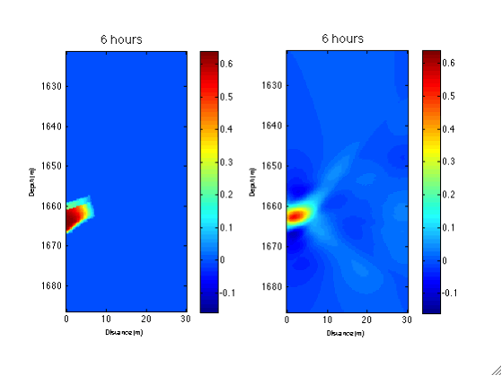
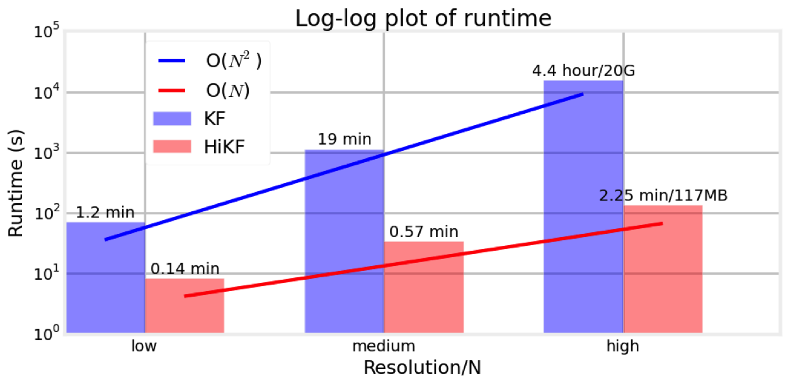
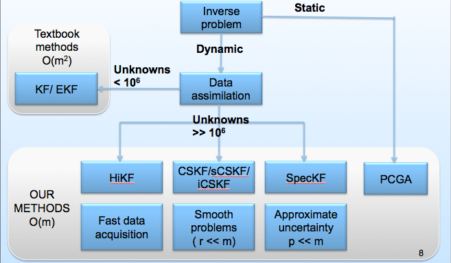
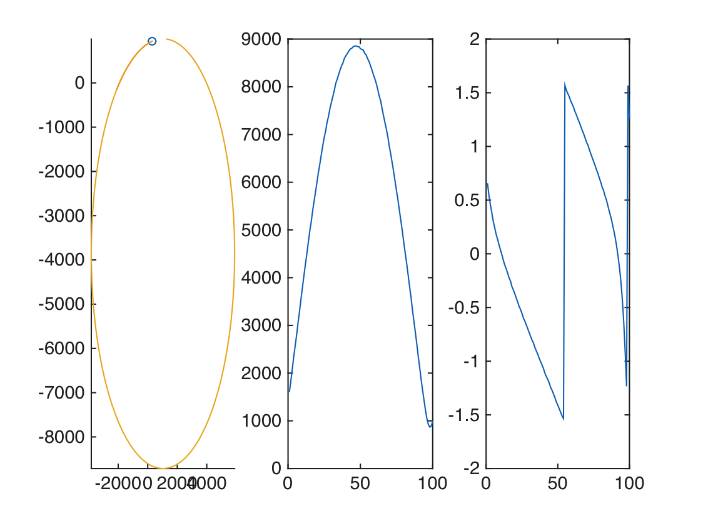
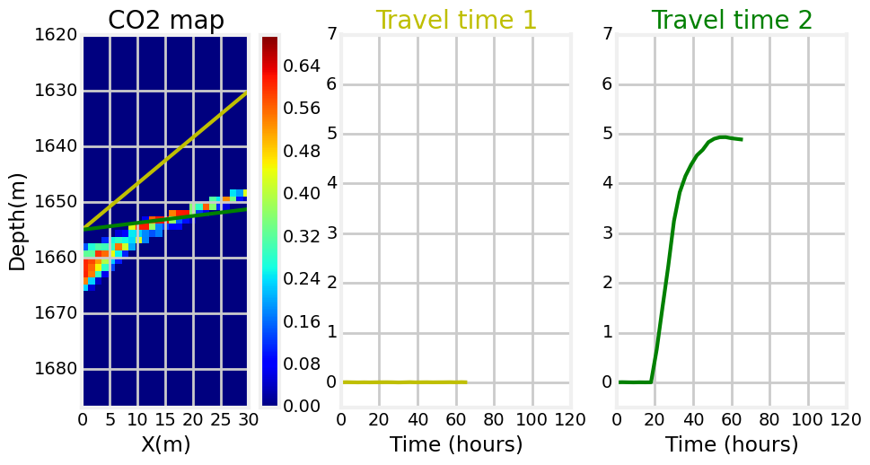

# DASoftware
============

This is a Matlab library of data assimilation methods developed to solve large-scale state-parameter estimation problems. Data assimilation approach has been widely used in geophysics, hydrology and numerical weather forecast to improve the forecast from a numerical model based on data sets collected in real time. Conventional approach like Kalman filter is computatioanlly prohibitive for large problems. The DASoftware library takes advantage of advances in computatioanl science and consists of new data assimilation approach that is scalable for large-scale problems. The functions and examples are produced based on collabrated work on data assimialtion documented in the papers listed in the Reference section.

**This is an ongoing project. The library is incomplete.**

## Highlight
- Data assimilation tools for Large-scale real-time estimation problems



- Computationally efficient methods with linear complexity(O(m)) that runs fast even on laptops



- Hands-on examples to learn Kalman filters without the knowledge of the technical details  


## Summary of Example
| Example  | Dimension | Linearity | Specific |
| -------: |:---------:|:----------|:--------:|
| Saetrom  | 1D        | Linear    | F(x,t)   |
| Target tracking  | 1D        | Nonlinear    | F(x),H(x)   |
| Frio     | 2D        | Linear    | F = I, fixed H   |


## Summary of methods

Here we show a diagram of the methods provided in the library.



|  Method  |  Assumptions                 |  Jacobian matrix|  Covariance matrix |   
| -------: |:----------------------------:|:------------------------: |:--------------|
|  KF      | only for small problem       | mn forward run| m^2 operations |
|  HiKF    | fast data acquisition/fixed H| no forward run| O(m) operations |
|          | random-walk forward model    | |  |
|  CSKF    |    smooth problem            | r forward run | O(m) operations|
|  SpecKF  | approximate uncertainty/fixed H| p forward run|  O(m) operations|
|  EnKF    | monte carlo based approach   | r forward run | O(m) operations|

## Start with examples

We have provided the users linear and nonlinear state estimation problems to get familier with data assimilation methods provided in the library. All the built-in examples can be operated using a simple one-line code with an input file (*.txt) including all the assimilation parameters.  

### 1D Saetrom example

- Run a 1-D linear state estimation example (Sætrom & Omre 2011) with Kalman filter  
```
[est,true,est_array,true_array]=main('examples/prm-saetrom-KF.txt')
```
- Example of user specified input in `prm-saetrom-KF.txt`
```
method          KF
model           Saetrom
m               100
n               13
nt              10
x_std           20
obsstd          1
cov_type        exponential
cov_power       1
cov_len         6
seed            10
```
- Figure shows the mean and 95% confidence interval at intial and final time step.


- Run the same problem using CSKF (Li et al. 2015) with __N = 20__ basis
```
[est,true,est_array,true_array]=main('examples/prm-saetrom-CSKF.txt')
```
- Example of user specified input in `prm-saetrom-CSKF.txt`
```
method          CSKF
model           Saetrom
N               20
BasisType       rSVD
m               100
n               13
nt              10
x_std           20
obsstd          1
cov_type        exponential
cov_power       1
cov_len         6
seed            10
```

### Target tracking example
Consider tracking an aircraft with an unknown constant maneuvering rate using a radar sensor (angle and bearing) yields a model with nonlinear dynamical and measurement equation. The unknown is the location, velocity and the turing rate.



```
[est,true,est_array,true_array]=main('examples/prm-target-KF.txt')
```
- Example of user specified input in `prm-target-KF.txt`
```
model           TargetTracking
rate            3
dt              1
method          KF
nt        	    100
seed            200
theta_Q         0.6
theta_R         0.3
```

### Frio example
A description of this example can be found in [Daley et al., 2011](#ref_co2) and [Li et al., 2014](#ref_h2). Figure below shows how traveltime time-series signals recorded by sensors at different location can be used to constrain the position of a moving CO2 plume. With the computational efficiency provided by methods like HiKF, these sensor data can be processed in real-time to monitor potential CO2 leakage.


```
[est,true,est_array,true_array]=main('examples/prm-Frio-HiKF.txt')
```

- Example of user specified input
```
model           Frio
resolution      low
method          HiKF
cov_type        exponential
cov_power       0.5
cov_length      900
nt              41
seed            200
theta_Q         1.14e-7
theta_R         1e-5
mexBBFMM        0
mexfile_name    expfun
```

#### Reference:
1. Judith Yue Li, Sivaram Ambikasaran, Eric F. Darve, Peter K. Kitanidis, A Kalman filter powered by H2-matrices for quasi-continuous data assimilation problems [link](https://www.dropbox.com/s/xxjdvixq7py4bhp/HiKF.pdf)<a name="ref_h2"></a>

2. Sivaram Ambikasaran, Judith Yue Li, Peter K. Kitanidis, Eric Darve, Large-scale stochastic linear inversion using hierarchical matrices, Computational Geosciences, December 2013, Volume 17, Issue 6, pp 913-927 [link](http://link.springer.com/article/10.1007%2Fs10596-013-9364-0)

3. Ghorbanidehno, H., A. Kokkinaki, J. Y. Li, E. Darve, and P. K. Kitanidis, 2014. Real time data
assimilation for large-scale systems with the Spectral Kalman Filter: An application in CO2
storage monitoring, Submitted to Advances in Water Resources, Special issue on data
assimilation (under review)

4. Judith Yue Li, A. Kokkinaki, H. Ghorbanidehno, E. Darve, and P. K. Kitanidis, 2015. The nonlinear compressed state Kalman filter for efficient large-scale reservoir monitoring, Submitted to Water Resources Research (under review)

5. Sætrom, J., & Omre, H. (2011). Ensemble Kalman filtering with shrinkage regression techniques. Computational Geosciences, 15(2), 271–292.

6. Daley, Thomas M and Ajo-Franklin, Jonathan B and Doughty, Christine, 2011. Constraining the reservoir model of an injected CO2 plume with crosswell CASSM at the Frio-II brine pilot, International Journal of Greenhouse Gas Control, 5(4), 1022-1030.<a name="ref_co2"></a> 

#### Acknowledgement
We want to thank Dr Jonanthan Ajo-Franklin for providing us part of the data of Frio example.

[ref2]: https://www.dropbox.com/s/3wrsljtlq0ub65p/KF-Saetrom.png?dl=0 "KF image"

<script type="text/javascript"
   src="http://cdn.mathjax.org/mathjax/latest/MathJax.js?config=TeX-AMS-MML_HTMLorMML"></script>
